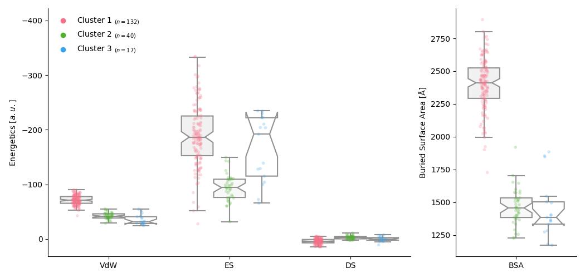
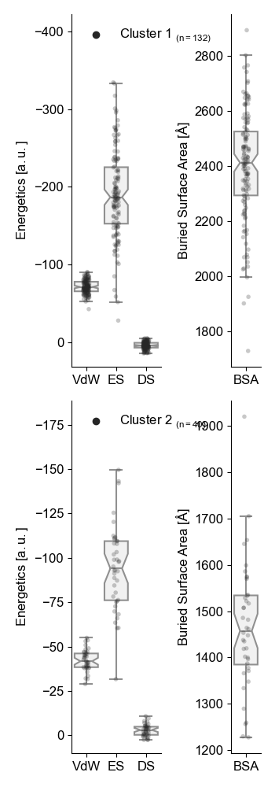

# Haddock Plotter

The Haddock Plotter is a Python script used to visualize and analyze HADDOCK result folders. HADDOCK (High Ambiguity Driven biomolecular DOCKing) is an information-driven flexible docking approach for the modeling of biomolecular complexes.

## Description

This script parses data from HADDOCK result folders and plots the information in an organized manner. The plots include information about the docking results such as Van der Waals energy, Electrostatic energy, and the Buried Surface Area. Furthermore, it is possible to include the HADDOCK score.

## Dependencies

- Python (version 3.6 or higher)
- Modules:
    - pandas
    - matplotlib
    - seaborn
    - numpy
    - os
    - sys
    - math
    - statistics

## Usage

### Installation

To install the HADDOCK_plotter package, you need to clone the repository, navigate to the cloned directory, and then install the package using pip. 

Make sure you are using the correct Python environment if you're working within a specific environment (e.g., a Jupyter notebook environment).

Follow the steps below:

1. First, clone the repository using git:

```bash
git clone https://github.com/ctueting/haddock_plotter.git
```

2. Navigate to the cloned repository:

```bash
cd haddock_plotter
```

3. Install the package:

```bash
pip install .
```

You're all set! You should now be able to import and use the `HADDOCK_plotter` package in your Python projects.

Remember to replace `pip` with the appropriate command if you're using a different package manager, or if your Python installation requires it (e.g., `pip3` or `python3 -m pip`).


### Import

Firstly, import the script:

```python
import HADDOCK_plotter.haddock_plotter as hp
```

### Running

To run the `haddock_plotter`, use the following command:

```python
haddock_plotter.plotter(paths, plot_type="single", min_cluster_size=0.1, include_haddock_score=False,
                        plot_single=False, modus="top", figsize=None,
                        legend_labels=None, show_n=True,
                        save=False, filename=None, filetype="png", dpi=100,
                        boxplot_args=None, stripplot_args=None, legend_args=None, rcParams={})
```

The parameters are as follows:

- `paths`: List of paths to the HADDOCK result folders.
- `plot_type`: Either "single" for individual plots per path or "multi" for all data in a single plot.
- `min_cluster_size`: Minimum cluster size to be considered, in proportion of total models.
- `include_haddock_score`: If True, includes HADDOCK score in the plot.
- `plot_single`: If True and `plot_type="single"`, each cluster gets its own subpanel in the plot.
- `modus`: Only applies for plot type "multi". "top" to only plot the largest clusters, "all" to plot all clusters.
- `figsize`: Size of the figure in inches.
- `legend_labels`: List of labels for the legend. Must be the same length as plotted clusters.
- `show_n`: If True, shows the n value of each cluster.
- `save`: If True, saves the figure.
- `filename`: The name of the file to save the figure. If None, defaults to 'image.png'.
- `filetype`: The type of the file to save the figure.
- `dpi`: The resolution of the saved image, in dots per inch.
- `boxplot_args`: Dictionary of arguments to be passed to the seaborn boxplot function. If None, uses default values: `{"showfliers": False, "color": "w", "notch": True}`.
- `stripplot_args`: Dictionary of arguments to be passed to the seaborn stripplot function. If None, uses default values: `{"s": 4, "alpha": 0.25, "jitter": True, "dodge": True}`.
- `legend_args`: Dictionary of arguments to be passed to the legend. If None, uses default values: `{"frameon": False, "loc": "upper left", "ncol": 1}`.
- `rcParams`: Dictionary of rc parameters to be updated before plotting. Defaults to None.

For the legend handles, the subplot (either the boxplot or the stripplot), with the most distinct colors, will be used.

## Customizable Parameters
- `boxplot_args`:
    Parameters for the seaborn.boxplot function. For a detailed description of these parameters, please check:
    [seaborn.boxplot documentation](https://seaborn.pydata.org/generated/seaborn.boxplot.html)
    
- `stripplot_args`:
    Parameters for the seaborn.stripplot function. For a detailed description of these parameters, please check:
    [seaborn.stripplot documentation](https://seaborn.pydata.org/generated/seaborn.stripplot.html)
    
- `legend_args`:
    Parameters for the matplotlib.legend function. For a detailed description of these parameters, please check:
    [matplotlib.legend documentation](https://matplotlib.org/stable/api/_as_gen/matplotlib.pyplot.legend.html)   
    
- `rcParams`:
    Matplotlib parameters for the styling of the figure. For a detailed description, please see:
    [matplotlib rcParams documentation](https://matplotlib.org/stable/tutorials/introductory/customizing.html#customizing-with-dynamic-rc-settings)
    
    By default, the following changes are applied in the code:
    ```python
    # figure settings
    plt.rcParams['pdf.fonttype'] = 42 # to make the file editable by Illustrator
    font = {'size'   : 12}
    plt.rc('font', **font)
    plt.rcParams['font.sans-serif'] = "Arial"
    plt.rcParams['font.family'] = "sans-serif"
    plt.rcParams['mathtext.it'] = 'Arial:italic'
    plt.rcParams['mathtext.bf'] = 'Arial:bold'
    plt.rcParams['mathtext.rm'] = 'Arial'
    plt.rcParams['mathtext.fontset'] = 'custom'
    plt.rcParams['mathtext.default'] = 'regular'
    plt.rcParams['font.serif'] = 'Arial'
    plt.rcParams['font.family'] = 'Arial'
    ```

    
### Examples
Define the path(s) to the HADDOCK result folder:
```python
p0 = "/Users/ctueting/projects/p53_Sirt1/monomeric_docking/HADDOCK/246705-p53dna_sirt1"
```


Plot all clusters with at least 5% of all water refined models with default settings:
```python
saving = {'save' : True, 'filename' : 'single_unmodified', 'filetype' : 'png', 'dpi' : 100}
parsed_data = hp.plotter(p0, min_cluster_size=0.05, **saving)
```

Plot:



Plot the same, but heavily modify the parameters:
```python
saving = {'save' : True, 'filename' : 'single_modified', 'filetype' : 'png', 'dpi' : 100}


legend_labels = ['Binding side 1', 'Binding side 2', 'False positive']
boxplot_args = {'linewidth' : 3, 'notch' : False, "palette" : ['green', 'red', 'blue']}
stripplot_args = {'palette' : 'dark:k', 'alpha' : 0.25, 's' : 5, 'jitter' : 0.25, 'marker' : 'D'}
legend_args = {'frameon' : True, 'ncol' : 3}
figsize = (10,3)
rcParams = {'text.color' : 'red', 'xtick.color' : 'green'}

parsed_data = hp.plotter(p0, min_cluster_size=0.05, show_n = False, legend_labels=legend_labels, legend_args=legend_args, boxplot_args=boxplot_args, stripplot_args=stripplot_args, rcParams=rcParams, figsize=figsize, **saving)
```

Plot:


Plot the same data, but create a subplot for each Cluster:
```python
saving = {'save' : True, 'filename' : 'single_subplots', 'filetype' : 'png', 'dpi' : 100}
parsed_data = hp.plotter(p0, plot_single=True, min_cluster_size=0.05, **saving)
```

Plot:



For comparison of multiple dockings, define all paths in a list:
```python
p0 = ["/Users/ctueting/projects/p53_Sirt1/monomeric_docking/HADDOCK/246705-p53dna_sirt1", 
      "/Users/ctueting/projects/p53_Sirt1/monomeric_docking/HADDOCK/246706-p53tet_sirt1"]
```


Plot the top cluster of all dockings against each other in a single plot:
```python
saving = {'save' : True, 'filename' : 'multi_top', 'filetype' : 'png', 'dpi' : 100}
parsed_data = hp.plotter(p0, plot_type="multi", min_cluster_size=0.05, **saving)
```

Plot:


Plot the all cluster of all dockings against each other in a single plot:
```python
saving = {'save' : True, 'filename' : 'multi_all', 'filetype' : 'png', 'dpi' : 100}
parsed_data = hp.plotter(p0, plot_type="multi", modus="all", min_cluster_size=0.05, **saving)
```

Plot:


## Contribution

Feel free to contribute to this project by providing bug reports, feature requests, or code improvements via pull requests. Please ensure that your code passes existing unit tests and, if applicable, add new tests for your features.


This README writing was assisted by ChatGPT, based on the original code and a fruitful conversation.
